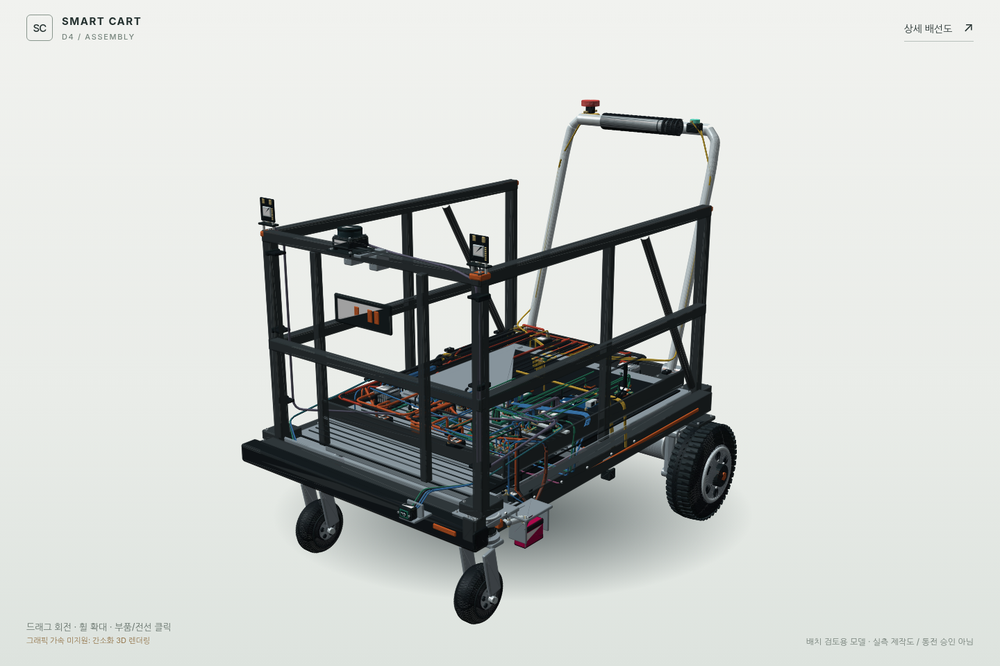

# Smart Cart D2 - Wiring and Integrated 3D Assembly

**English** | [한국어](README-KR.md)

> **ENGINEERING HOLD. Do not energize from these illustrations.**
> This is a functional wiring and spatial review package, not a fabrication release, a certified safety circuit, manufacturer CAD, or a physically tested vehicle.



Open **`index.html`** for the detailed cart assembly and **`wiring.html`** for the interactive wiring workbench. Both pages use the same dataset: 55 electrical reference IDs and 131 connection records. USB/OEM cable assemblies are single logical records, not individual conductor counts.

The original differential drive, passive front casters, approximate chassis proportions, and two downward ToF units are retained. The low LiDAR is removed; a mast places the proposed scan centre at **1.15 m**. Added electrical envelopes and harness routes are approximate. The old battery box is not proof that a real 108 Ah battery fits.

## Run / publish

```sh
python -m http.server 8000
```

Open `http://localhost:8000/` or `/wiring.html`. No npm, bundler, CDN, API key, backend, hardware-control APIs, or ROS runtime is required. Publish the **contents** of this folder at the repository root with `.nojekyll`; keep all relative paths. The package has not been committed, pushed, or deployed to the remote repository.

The 3D page attempts native WebGL 2. If context creation fails, an interactive Canvas 2D software renderer projects the same 3D triangles and retains camera controls and object picking. This is not an image placeholder. The software path may be slower. The test environment could not create a WebGL 2 context; that path is not claimed as GPU-tested. See [QA](docs/QA.md).

## Features

The wiring page contains six views: overview, drive power, emergency stop, 5 V/USB, SPI/I²C, and UART. Zoom, pan, select a module or connection, inspect ports and nets, search/filter the connection table, export CSV/SVG, and follow the same ID into the 3D scene. Checklist notes are stored locally where browser storage is available; completion never changes the engineering release from HOLD.

The 3D page includes chassis and electrical detail, separate module IDs, 131 harness paths, six camera presets, orbit/pan/zoom, searchable components, cover visibility, exploded inspection, explanatory sensor graphics, and PNG/GLB export. Exploding the geometry hides harnesses to avoid suggesting that fixed routes remain connected to moved parts. Scan graphics are not measured sensing coverage or a safe zone.

## Electrical redesign is conditional

The proposed D2 topology replaces the B1 self-hold contactor circuit with dual-channel E-stop input, monitored manual reset, EDM, and two series DC contactors. Precharge is downstream of both contactors. Each controller link has its own conditional regeneration clamp/dump and bleeder path. The exact modules, their internal control, thresholds, fuse ratings, and cable sizes still require selection and test.

D2 excludes the unvalidated steering servo option, replaces the 12 V coil supply with a regulated 24 V buck-boost safety supply and matching coils, adds independent 5 V OVP and reverse-feed checks, preserves USB-only ESP32 power, separates UART signal power domains, and routes the two ToF units through independent mux channels. A mux is not a long-distance bus buffer. Power removal is not a mechanical brake. Low obstacles and load occlusion require separate sensing and stopping validation.

The old procurement BOM is not an approved drop-in D2 shopping list. See [changes](docs/CHANGELOG.md), [review](docs/SAFETY-REVIEW-KR.md), [pin map](docs/PIN-MAP-KR.md), and [sources](docs/SOURCES.md).

## Data / exports / validation

- `data/design.json`, `js/design-data.js`: identical shared design data.
- `data/point-to-point.csv`: every logical connection and its hold conditions.
- `data/component-register.csv`: electrical reference register, not a full procurement BOM.
- `assets/models/Smart-Cart-D2.glb`: assembled metre/Y-up scene with reference and net metadata.
- `assets/drawings/D2-*.svg`: vector schematic views.

```sh
python tools/build_data.py
node tests/validate.mjs
```

The tests inspect source/data consistency, endpoints, coverage, mesh geometry and GLB structure. They do **not** verify electrical safety, thermal performance, EMC, stopping distance, structural strength, reliability, PL or SIL. The optional standalone HTML files are snapshots and must be re-bundled after source changes.

See [source notice](SOURCE-NOTICE.md). No new licence is assigned to third-party documentation, prior repository content, product names, or manufacturer drawings.
